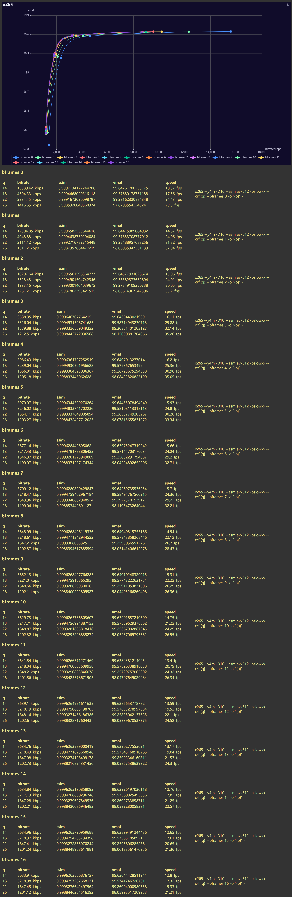

my motivation of choosing bframes to test with this video as a start is obvious. (assuming you've watched this video)
based on results from two tests here so far bframes 3, 5 and 7 have good scores, but there's a kind of tendency that at some point scores start to decrease when bframes goes higher.
