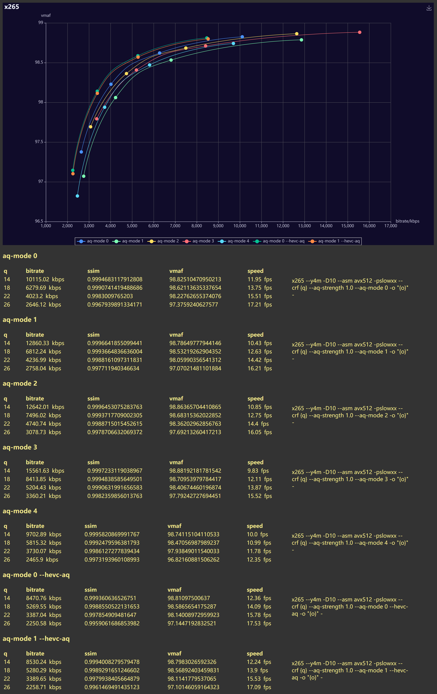

if only look at other results, you may think preset slowxx is the empty "tune vmaf" in the flesh, but let me tell you, I won't consider using any aq-mode other than aq-mode=1 in most cases at least for now and foreseeable future ~(since everyone seemed to only focus on developing aq-mode=2 variants (aq-mode=1, you cannot come to the orgy!))~ despite it has the worst result in terms of vmaf scores, and this is based on the visual observation of myself.
which is relatively safe because aq only changes "where does the bits flow" right? it's just that, I really don't like the decisions made by other modes.
aq-strength=1 will be overridden by aq-mode=0 which is presented as aq-mode=1 aq-strength=0, and hevc-aq is not affected by aq-strength except aq-strength=0.
