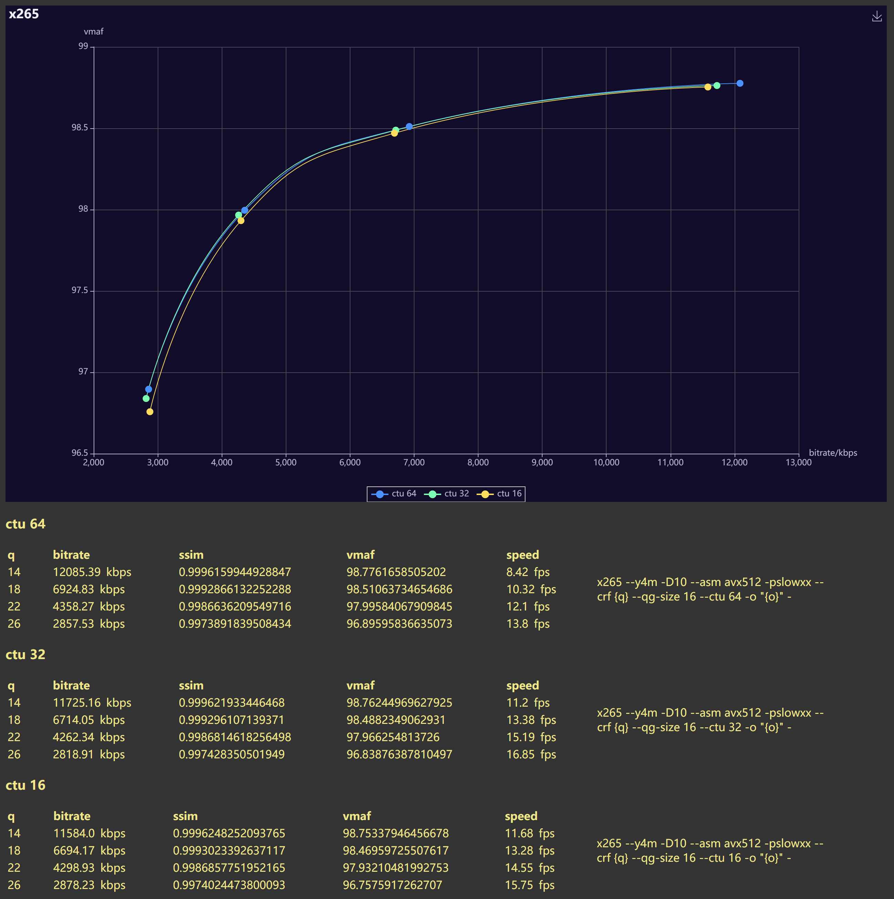

it's unclear why default value of qg-size is changed from 64 to 32 a long time ago, but with default qg-size=32 you can safely use ctu=32 and rejoice in the increased speed and quality,  
although the speed increase is likely due to more "multi-threading potentiality"("mtp" for short(?) kinda thing.  
so I would say if you don't have many cores or you are doing some good amount of pre-processing so that "mtp" wouldn't be a bottleneck, give cranking up both qg-size and ctu to 64 a shot.

