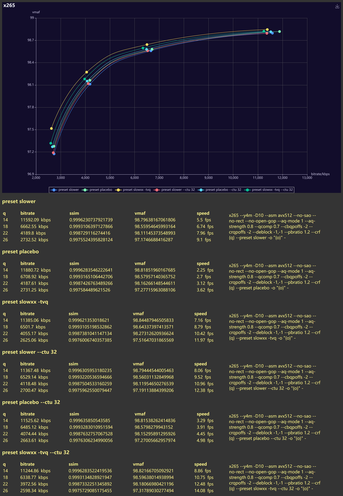

base args are set to normalize the results.  
you can see preset slowxx starts at what the name suggests although closer to preset slower, then with some enhancements it gets better.  
i didn't include merange=92 in enhancements because of my subjective thought of "me is somewhat negligible so does merange" and hey, if you are going that direction, hme may surprise you.  

now with tune vq.  
I think it's only fair to include ctu=32 variants because like I said in the "actual" ctu test: "with default qg-size=32 you can safely use ctu=32 and rejoice in the increased speed and quality" (because tune vq uses ctu=64 and qg-size=64, base params does not include ctu=32 this time)  
seems like even more so with vanilla presets, but opposite for tune vq because it uses qg-size=64, reducing ctu actually reduces qg-size as well.  
