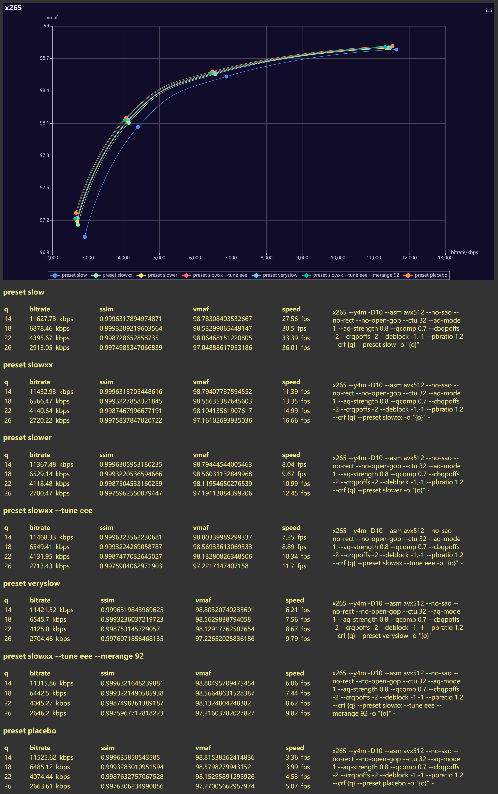

base args are set to normalize the results.  
you can see preset slowxx starts at what the name suggests although closer to preset slower, then with some enhancements it gets better.  
i didn't include merange=92 in enhancements because of my subjective thought of "me is somewhat negligible so does merange" and hey, if you are going that direction, hme may surprise you.  
