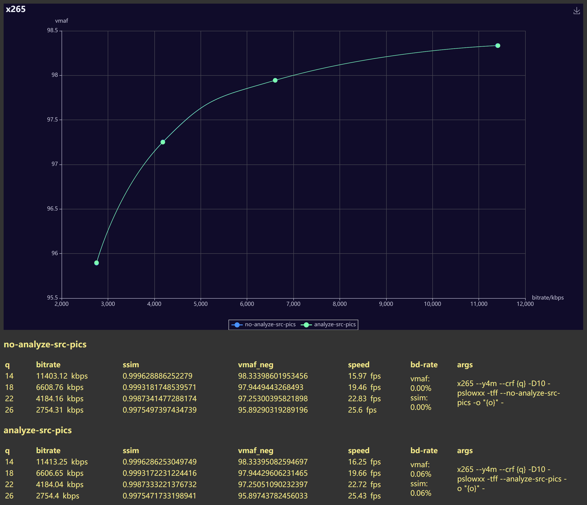

the main functionality of this feature is to "Enable motion estimation with source frame pixels, in this mode, motion estimation can be computed independently"
my assumption is this feature is designed for lowering the encode latency or something similar?
the encoding speed basically the same with back and forth but the quality is slightly worse, again my assumption is that the ME done on source picture is harmful to the "later steps" because the residual coding needs recon picture and of course there's difference between source and recon pictures thus making the ME results slightly less accurate.
