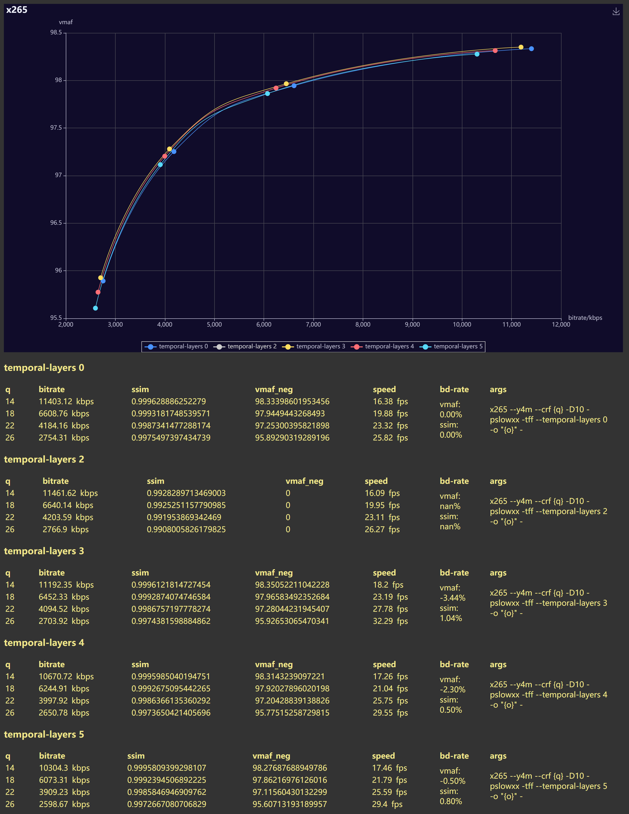

valid values are 0,2,3,4,5
value above 2 x265 warns that b-adapt is disabled
value 2 will not disable b-adapt but gives some weird misplaced or duplicated frame in seemingly random places so completely invalidates the result. tried with less b-frames or manually disable b-adapt, not very helpful, not shown in screenshot.
