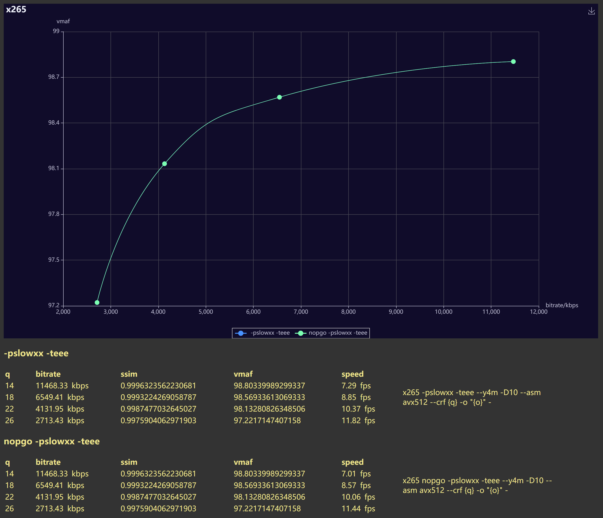

the encoding speed is the test objective here, so a warming up step is done beforehand, this should reduce the influence but will not be the routine.  
nopgo is the exact same code built with exact same toolchain, only without pgo, but let's just keep it *Internal (TM)*.  
