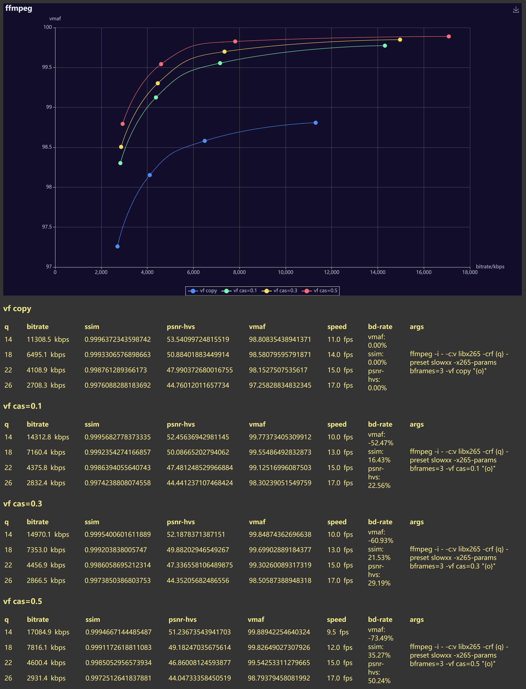
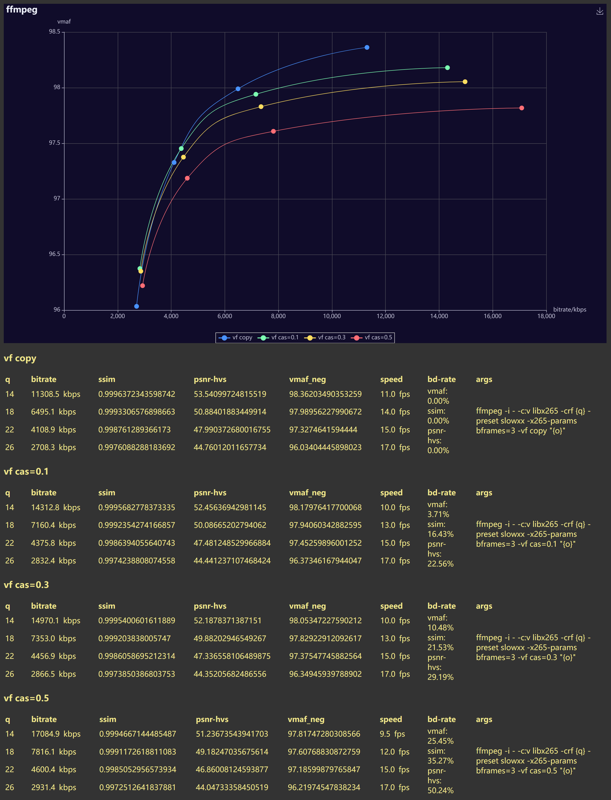

The **"non-neg"** vmaf is very unreliable when you cannot rule out the sharpening.    
Only trust vmaf results with their test conditions carefully controlled.    
Or, just "when in doubt, use neg", maybe...    

