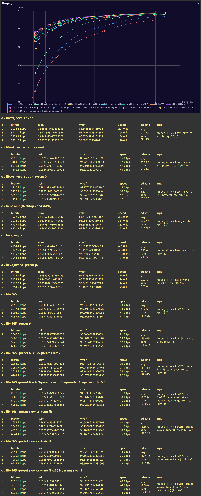

did this sometime ago  
now regenerate report with bd-rate  
nvenc result is valid for gen6,7,8, they are the same in hevc i believe  
libkvazaar in ffmpeg doesn't support 10bit, skip  
please note that this is 1-pass abr mode, not exactly ideal  
it's hard to control them to similar bitrate range using quality control  
you see, vmaf and ssim sometimes agree with each other some times disagree  
even change aq-mode which i think don't really affect "rd performance" make a big difference in vmaf while ssim is more stable  
but with sao (which most "rip" people think is terrible) ssim give positive results while vmaf "correctly" gives negative  
i should say, there's no single most reliable metric  
in the end, use your eyes.  
